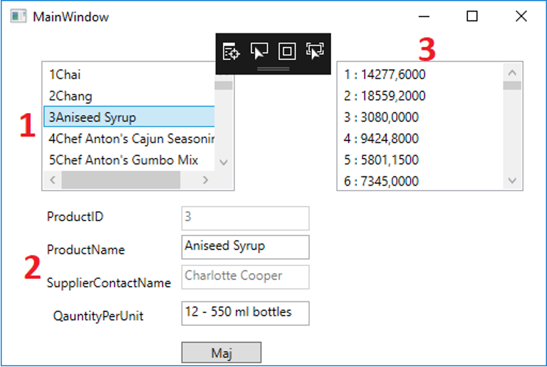

# ExamDotNetSept2022

1. la liste des produits
   La liste des produits affichera les ids et les noms des produits présents dans la table « Products ». Vous utiliserez le template suivant pour la « listBox ».
   <DataTemplate x:Key="listboxTemplate">
   <StackPanel Orientation="Horizontal">
   <!-- id du produit -->
   <TextBlock Text="{Binding A vous de compléter}"/>
   <!-- nom du produit -->
   <TextBlock Text="{Binding A vous de compléter}"/>
   </StackPanel>
   </DataTemplate>

Lorsqu’on clique sur un élément de la liste, le formulaire se remplit. 2. le formulaire
Le formulaire est composé uniquement de 4 champs de la table « Products » à savoir l’id du produit, le nom du produit, le nom de contact du fournisseur et la quantité par unité. L’id du produit ainsi que le nom du contact du fournisseur ne sont pas modifiables. Ils sont simplement affichés. Un bouton « Maj » permet de mettre à jour en base de données le nom du produit et/ou la quantité par unité. 3. le total des ventes par produit (query LINQ)
Cette liste affiche le total des ventes par produit. Pour chaque « ProductId », le total des ventes est calculé. Vous obtiendrez le total des ventes en additionnant pour chaque produit toutes les lignes «OrdersDetails » concernées. Pour chacune de ces lignes, vous devrez multiplier le prix unitaire et la quantité.
Ressources
Vous disposez dans le répertoire Ressources :

1. du fichier « instnwnd.sql » pour l'installation de la base de données Northwind
2. de la théorie, exercices et solutions de toutes les séances du cours.
3. Une image de rappel des Data Templates.

Ce qui est demandé

1. Créer une application WPF respectant l’architecture MVVM.
2. Réaliser les 3 fonctionnalités précisées ci-dessus.
